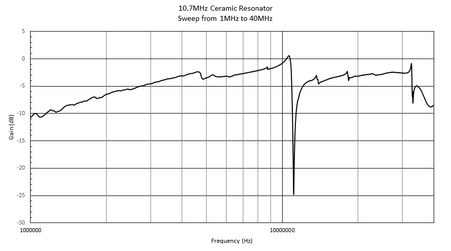
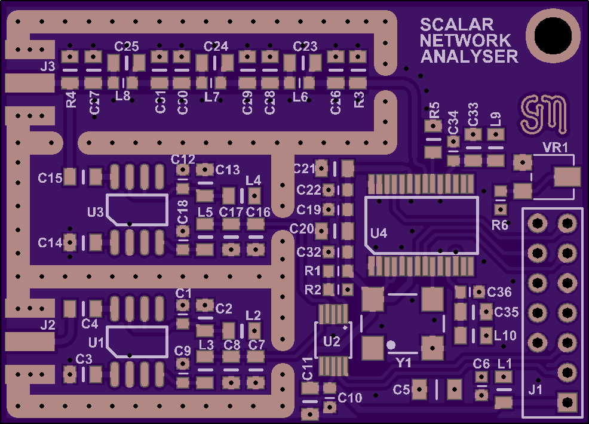

# Scalar Network Analyser

Retrieved from: http://stevenmerrifield.com/scalar/index.html

Original design by Steven J. Merrifield.

This project is a simple scalar network analyser using a DDS, log amplifiers, multi channel ADC and a generic I/O interface.

The pinout matches a Raspberry Pi, but any micro-controller may be used to program the DDS and read the ADC.

The analog bandwidth has been deliberately set at 30MHz.

Note how the measured response matches the theoretical simulation very closely.

There is approximately 0.02dB variance between 1kHz and 30MHz.

The noise floor averages around -69dB throughout the passband, with shielding in place.

This circuit is a little different from most in that the filtered DDS output is measured in addition to the input voltage from the EUT.

This allows a more accurate measurement as it doesn't assume the output is constant, any variations due to loading effects are automatically compensated for.

The PCB has been shared at [OSH Park](https://oshpark.com/shared_projects/bS2bOYZ6),
download [source code](http://stevenmerrifield.com/scalar/scalar_source_code.c)

Right click on the images to open larger versions.

Last update: 29 Mar 2019 © Steven J. Merrifield

## OSH Park - Scalar Network Analyser

By sjm

2 layer board of 1.97 x 1.42 inches (50.1 x 36.1 mm).

Uploaded: February 20th, 2019 22:18.

Shared: March 29th, 2019 09:35

Total Price: $14.00

[Download gerber files](SNA_gerber.zip)

More details here: http://stevenmerrifield.com/scalar/index.html

